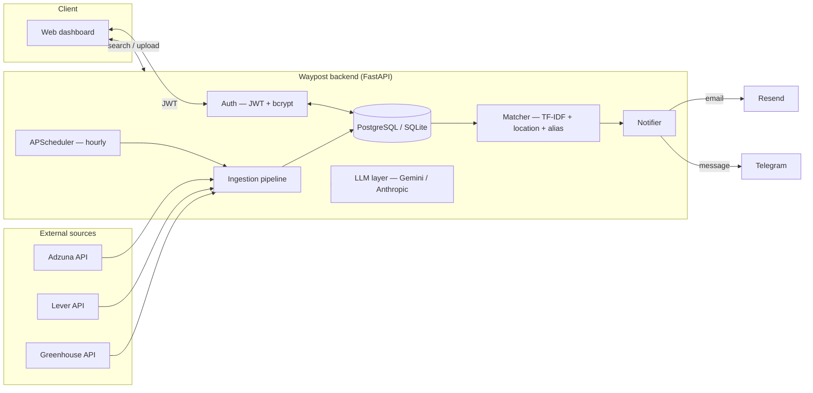

<div align="center">

# Waypost

**An autonomous placement agent that finds, ranks, and alerts you to jobs — so you don't have to keep checking.**

[](https://www.python.org/)
[](https://fastapi.tiangolo.com/)
[](https://www.sqlalchemy.org/)
[](#license)
[](#honest-limitations)

</div>

---

## Overview

Waypost is a full-stack job placement agent built for people who are
tired of refreshing job boards. It runs continuously in the background,
pulling fresh postings from public job-board APIs, scoring each one
against a candidate's actual resume, and pushing a notification —
by email or Telegram — the moment something worth applying to appears.

It's not a job board. It's the layer that sits on top of job boards and
does the searching for you.

**In one sentence:** register, upload a resume, and Waypost quietly
watches the market and taps you on the shoulder when it finds something
that fits.

---

## Table of contents

- [Core features](#core-features)
- [Architecture](#architecture)
- [Tech stack](#tech-stack)
- [Project structure](#project-structure)
- [Getting started](#getting-started)
- [Environment variables](#environment-variables)
- [API reference](#api-reference)
- [Security model](#security-model)
- [Design decisions](#design-decisions)
- [Honest limitations](#honest-limitations)
- [Roadmap](#roadmap)
- [License](#license)

---

## Core features

| | |
|---|---|
| 🔐 **Authentication** | Email/password accounts secured with bcrypt hashing and JWT bearer tokens; full forgot/reset password flow with single-use, time-limited, hashed reset tokens |
| 🧭 **Continuous discovery** | A background scheduler polls Greenhouse, Lever, and Adzuna every hour on behalf of every registered user's stated roles and locations — no manual searching required |
| 📄 **Resume intelligence** | Upload a PDF or DOCX; the agent extracts raw text, skills, and estimated experience automatically |
| 🎯 **Smart matching** | TF-IDF relevance ranking with location-aware filtering, including city-alias resolution (Bangalore ↔ Bengaluru, Bombay ↔ Mumbai, etc.) and fuzzy string matching for spelling variants |
| 📊 **ATS scoring** | Scores a resume against any job description the way an applicant-tracking system would, combining keyword/formatting checks with LLM-generated qualitative feedback |
| 🔔 **Proactive alerts** | Push notifications — not pull — via email (Resend) and/or Telegram the moment a new posting clears the user's match threshold, with automatic de-duplication |
| 🤖 **Conversational agent** | A natural-language endpoint lets users say things like *"find me remote data analyst roles in India"* and have the agent decide which tools to call |
| 🧪 **Zero-key demo mode** | Seed realistic sample postings instantly to test the full search → match → notify pipeline before configuring any external API |

---

## Architecture



The scheduler is the heart of the "agent" behavior: it doesn't wait to
be asked. Every hour, it re-fetches postings for every distinct
role/location combination any registered user cares about, scores them
against each profile, and fires a notification for anything new that
clears that user's match threshold — all without a human triggering it.

---

## Tech stack

| Layer | Choice | Why |
|---|---|---|
| API framework | **FastAPI** | Async-first, automatic OpenAPI docs, strong typing via Pydantic |
| Database | **PostgreSQL** (Neon) / SQLite | Postgres for persistence in production; SQLite for zero-setup local dev |
| ORM | **SQLAlchemy 2.0** | Dialect-agnostic — same models work against both databases unchanged |
| Auth | **JWT (python-jose) + bcrypt (passlib)** | Stateless tokens, industry-standard password hashing |
| Scheduling | **APScheduler** | In-process background jobs, no external infra needed for MVP scale |
| Matching | **scikit-learn (TF-IDF)** | Lightweight, dependency-free relevance scoring without needing a vector DB |
| LLM | **Google Gemini** (default) / Anthropic (fallback) | Free tier covers ATS feedback + conversational agent at MVP scale |
| Email | **Resend (HTTPS API)** | SMTP ports are blocked on many free hosting tiers (Render included); HTTPS is not |
| Messaging | **Telegram Bot API** | Zero-cost, zero-infra push notification channel |
| Frontend | **Vanilla HTML/CSS/JS** | Served directly by FastAPI — one deployable unit, no separate build pipeline |

---

## Project structure

```
placement_agent/
├── app/
│   ├── main.py                  FastAPI app — all HTTP endpoints
│   ├── agent.py                  Claude/Gemini tool-calling orchestrator
│   ├── scheduler.py               Background ingestion + notification loop
│   ├── db.py                       Models (Job, UserProfile, MatchResult) + auto-migration
│   │
│   ├── core/
│   │   ├── auth.py                  Password hashing, JWT issue/verify, reset tokens
│   │   ├── notifier.py               Email (Resend) + Telegram delivery
│   │   ├── matching_notify.py         Detects new high-score matches, triggers alerts
│   │   ├── matcher.py                  TF-IDF ranking + location/alias/fuzzy filtering
│   │   ├── resume_parser.py             PDF/DOCX → text → skills extraction
│   │   ├── ats_scorer.py                 Keyword + LLM-based ATS scoring
│   │   ├── ingest.py                      Multi-source fetch, dedup, persist
│   │   └── llm.py                          Provider-agnostic LLM layer (Gemini/Anthropic)
│   │
│   ├── sources/
│   │   ├── greenhouse.py            Public Greenhouse board API
│   │   ├── lever.py                  Public Lever board API
│   │   └── adzuna.py                  Adzuna aggregator API
│   │
│   ├── data/
│   │   ├── companies.json           Fallback Greenhouse/Lever board list
│   │   ├── sample_jobs.json          Demo postings for zero-key testing
│   │   └── city_aliases.json          Location alias map for matching
│   │
│   └── static/
│       └── index.html               Login/dashboard SPA (served at `/`)
│
├── requirements.txt
├── runtime.txt                     Pinned Python version for deployment
└── .env.example
```

---

## Getting started

### Prerequisites
- Python 3.11
- A free [Neon](https://neon.tech) Postgres database (or use SQLite locally with zero setup)

### Local setup

```bash
git clone <your-repo-url>
cd placement_agent
pip install -r requirements.txt

cp .env.example .env
# fill in .env — see Environment variables below

uvicorn app.main:app --reload --port 8000
```

Open `http://localhost:8000` for the dashboard, or drive the API directly (see [API reference](#api-reference)).

**No API keys yet?** Register an account, then call:
```bash
curl -X POST http://localhost:8000/jobs/seed-sample -H "Authorization: Bearer $TOKEN"
```
This loads five realistic sample postings with zero external calls, so you can exercise
search, matching, and notifications immediately.

### Deploying

Waypost is a single deployable service — the dashboard is served by the
same FastAPI process that runs the API, so there's nothing to build or
host separately.

| Setting | Value |
|---|---|
| Build command | `pip install -r requirements.txt` |
| Start command | `uvicorn app.main:app --host 0.0.0.0 --port $PORT` |
| Runtime | Pinned via `runtime.txt` (Python 3.11.9) |

---

## Environment variables

<details>
<summary><strong>Required</strong></summary>

| Variable | Description |
|---|---|
| `JWT_SECRET_KEY` | Signs login tokens. Generate with `python -c "import secrets; print(secrets.token_hex(32))"` |
| `DATABASE_URL` | `sqlite:///./placements.db` locally, or a Postgres connection string in production |

</details>

<details>
<summary><strong>AI features</strong></summary>

| Variable | Description |
|---|---|
| `GEMINI_API_KEY` | Free tier, no card required — [aistudio.google.com/apikey](https://aistudio.google.com/apikey) |
| `GEMINI_MODEL` | Defaults to `gemini-2.5-flash` |
| `ANTHROPIC_API_KEY` | Optional fallback if Gemini isn't configured |

</details>

<details>
<summary><strong>Notifications</strong></summary>

| Variable | Description |
|---|---|
| `RESEND_API_KEY` | Free tier email delivery via HTTPS — [resend.com](https://resend.com) |
| `RESEND_FROM` | Defaults to `onboarding@resend.dev` (sends to your own verified address only, until a custom domain is verified) |
| `TELEGRAM_BOT_TOKEN` | Created via [@BotFather](https://t.me/BotFather) |
| `FRONTEND_BASE_URL` | Your deployed URL, used to build password-reset links |

</details>

<details>
<summary><strong>Job sources (optional — fallback list used if blank)</strong></summary>

| Variable | Description |
|---|---|
| `GREENHOUSE_BOARDS` | Comma-separated company board tokens |
| `LEVER_BOARDS` | Comma-separated company board tokens |
| `ADZUNA_APP_ID` / `ADZUNA_APP_KEY` | Free signup at [developer.adzuna.com](https://developer.adzuna.com/signup) |

</details>

Full reference with inline comments lives in `.env.example`.

---

## API reference

All endpoints except `/auth/register`, `/auth/login`, `/auth/forgot-password`,
`/auth/reset-password`, and `/health` require `Authorization: Bearer <token>`.

<details>
<summary><strong>Authentication</strong></summary>

```bash
# Register
curl -X POST /auth/register \
  -F "name=Jane Doe" -F "email=jane@example.com" -F "password=supersecret123" \
  -F "job_titles=Software Engineer,Data Analyst" -F "locations=Bangalore,Remote"

# Log in
curl -X POST /auth/login -F "email=jane@example.com" -F "password=supersecret123"

# Forgot password
curl -X POST /auth/forgot-password -F "email=jane@example.com"

# Reset password
curl -X POST /auth/reset-password -F "token=<from email link>" -F "new_password=newpass123"
```

</details>

<details>
<summary><strong>Resume & matching</strong></summary>

```bash
# Upload resume (PDF or DOCX)
curl -X POST /resume/upload -H "Authorization: Bearer $TOKEN" -F "file=@resume.pdf"

# Search jobs (ranked against your uploaded resume automatically)
curl -X POST /jobs/search -H "Authorization: Bearer $TOKEN" \
  -F "job_titles=Software Engineer" -F "locations=Bangalore,Remote"

# ATS score against a specific job description
curl -X POST /resume/ats-score -H "Authorization: Bearer $TOKEN" \
  -F "job_description=We need a Python developer with Django and AWS..."
```

</details>

<details>
<summary><strong>Agent & notifications</strong></summary>

```bash
# Natural-language agent
curl -X POST /agent/chat -H "Authorization: Bearer $TOKEN" \
  -F "message=Find me remote data analyst internships in India"

# Manually trigger a fetch cycle
curl -X POST /jobs/ingest -H "Authorization: Bearer $TOKEN" \
  -F "search_query=data analyst" -F "search_location=Bangalore"

# Link Telegram
curl -X POST /notifications/telegram/link -H "Authorization: Bearer $TOKEN" \
  -F "telegram_chat_id=123456789"

# Seed demo data (no API keys required)
curl -X POST /jobs/seed-sample -H "Authorization: Bearer $TOKEN"
```

</details>

---

## Security model

- **Passwords** — hashed with bcrypt, never stored or logged in plaintext
- **Sessions** — stateless JWTs, expire after `JWT_EXPIRE_MINUTES` (default 24h)
- **Password reset** — a random token is generated per request; only its
  SHA-256 hash and a 30-minute expiry are ever persisted, mirroring how
  the password itself is handled. Tokens are single-use and consumed on
  successful reset.
- **User enumeration resistance** — `/auth/forgot-password` returns an
  identical response whether or not the email is registered
- **Schema drift protection** — `db.py` runs a lightweight auto-migration
  on startup that diffs live database columns against the model and adds
  anything missing, preventing "column does not exist" errors after a
  model change ships without a corresponding manual migration
- **Connection resilience** — the database engine uses `pool_pre_ping`
  and a 3-minute `pool_recycle`, since managed Postgres providers (Neon
  included) silently close idle connections that a naive pool would
  otherwise try to reuse

---

## Design decisions

**Why Greenhouse, Lever, and Adzuna, and not LinkedIn/Naukri?**
Scraping either violates their Terms of Service and reliably gets IPs
banned. Greenhouse and Lever expose genuinely public, unauthenticated
board APIs by design — many of the startups and scale-ups that post
"off-campus" opportunities students otherwise miss are on these
platforms. Adzuna adds broad aggregator coverage with a real,
compliant free-tier API. New sources should follow the same
`fetch_jobs() -> list[dict]` contract in `app/sources/`.

**Why email over Resend's HTTPS API instead of SMTP?**
Several hosting providers — Render's free tier among them — block
outbound traffic on SMTP ports (25/465/587) entirely to prevent spam
abuse. That's a platform-level restriction no amount of correct SMTP
configuration can work around. Resend's API is a normal HTTPS POST,
which is unaffected.

**Why TF-IDF instead of embeddings?**
TF-IDF has zero external dependencies, zero cost, and no added
infrastructure — a deliberate choice to validate the product with real
usage before introducing a vector database and embeddings API. See
[Roadmap](#roadmap).

---

## Honest limitations

This is an MVP. Read this before showing it to real users.

1. **ATS scoring is an estimate**, not a simulation of any specific
   platform (Workday, Taleo, iCIMS all use proprietary parsing). The
   API response includes a `disclaimer` field for this reason.
2. **Matching uses TF-IDF, not semantic embeddings.** Good enough to
   validate the product; a vector-based approach would meaningfully
   improve match quality at scale.
3. **No LinkedIn/Naukri coverage**, by design — see [Design decisions](#design-decisions).
4. **Single-process scheduler.** Fine for MVP/small-user-base load;
   move to Celery beat + workers (or a managed cron) before scaling
   past one instance.
5. **Telegram linking is manual** (the user pastes their own chat ID).
   A bot `/start` handler could auto-capture this instead.

---

## Roadmap

- [ ] Replace TF-IDF with embeddings + a vector store once usage data justifies it
- [ ] Add RemoteOK / WeWorkRemotely as additional free sources
- [ ] Auto-capture Telegram chat ID via a bot `/start` handler
- [ ] Move scheduling to a distributed worker for multi-instance deployments

---

## License

MIT — use freely, attribution appreciated.

<div align="center">
<sub>Built with FastAPI, SQLAlchemy, and a genuine dislike of manually refreshing job boards.</sub>
</div>
